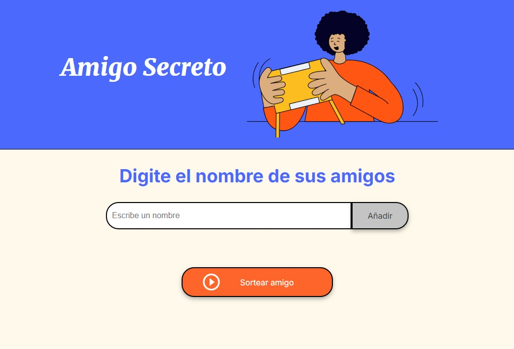
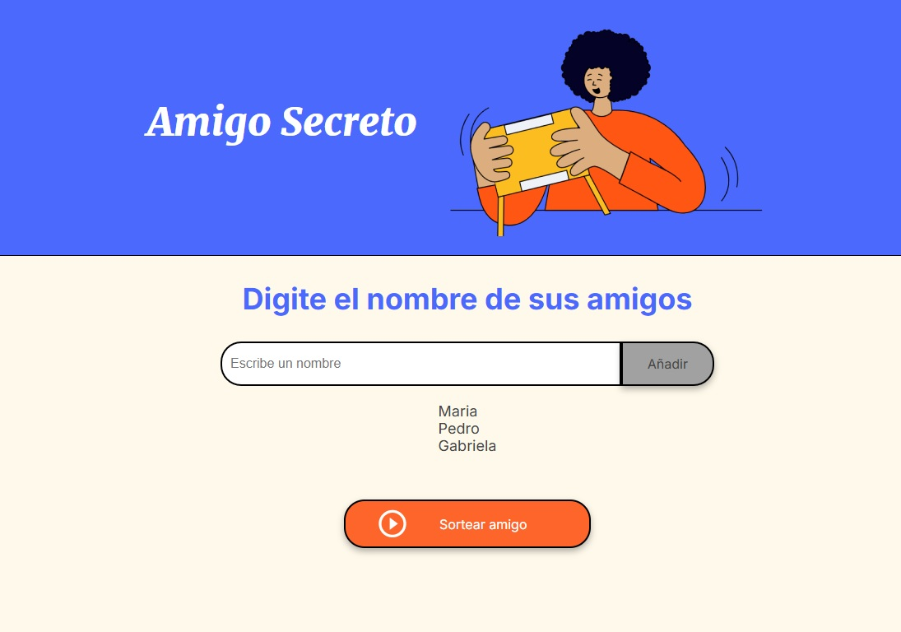
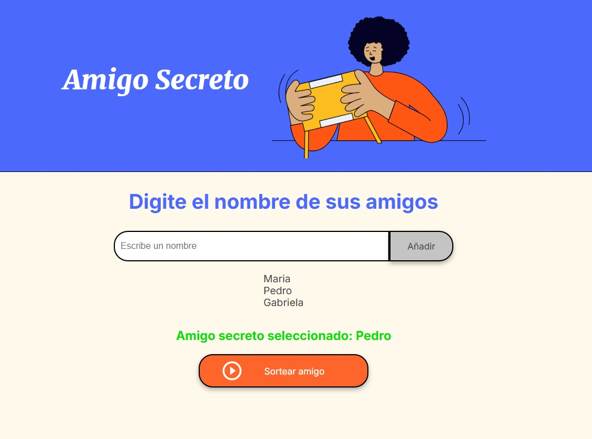

<em> # Challenger amigo secreto </em>

## Ejecicio realizado para aprender en curso de JavaScrip, el cual solicita ingresar un listado de nombres almacenadndolos en un arreglo.
La idea es ingresar cuantos nombres quiera, luego de almacenarlos, generar un sorteo aleatorio y mostrarlo en la web.

## En este challenger se utilizó Html y Javascrip.

